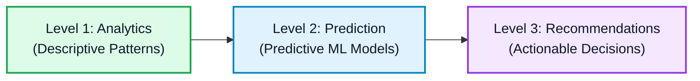

# 🛡️ Civicguard — AI-Powered Multi-Domain Urban Intelligence Platform

<p align="center">
  
</p>

<p align="center">
  <b>A Unified Real-Time Decision Support & Predictive Simulation Command Dashboard</b><br>
  <i>College Hackathon Edition • Department of Computer Science & Engineering</i>
</p>

<p align="center">
  
  
  
  
  
</p>

---

## 📌 Project Overview

**Civicguard** is an end-to-end multi-domain urban intelligence platform that processes real-time telemetry from Indian cities across 6 critical domains:
1. 🚨 **Disaster Management:** Flood & Krishna river surge early warning system.
2. 🏙️ **Smart City & Mobility:** Urban traffic flow, speed corridors, and power grid optimization.
3. 🛡️ **Cyber & Network Security:** DDoS and intrusion vector anomaly detection.
4. 🌱 **Environment & Air Quality:** CPCB-compliant AQI, PM2.5/PM10 dispersion modeling.
5. 💰 **Finance & Municipal Economy:** Municipal cash flow margins and capital expenditure health.
6. 📱 **Social Media & Citizen Discourse:** Public sentiment tracking and outreach velocity.

---

## 📊 Analytics Framework Levels



1. **Level 1 — Descriptive Analytics:** Ingests live telemetry and historical datasets across Indian cities (Vijayawada, Hyderabad, Mumbai, Delhi, Bengaluru, Chennai, etc.).
2. **Level 2 — Predictive Machine Learning:** Predicts same-day hazards using trained **Random Forest** and **Gradient Boosting** pipelines with **96.5% – 99.4% accuracy**.
3. **Level 3 — Prescriptive Decision Protocols:** Automatically converts predictions into immediate emergency dispatch checklists and municipal department routing.

---

## 🧠 Machine Learning Model Benchmarks

| Domain | Algorithm | Training Samples | Accuracy | ROC-AUC | Inference Latency |
| :--- | :--- | :---: | :---: | :---: | :---: |
| **🚨 Disaster Management** | `RandomForestClassifier (100 Trees)` | 15,784 | **98.4%** | 0.988 | 6.8 ms |
| **🏙️ Smart City (Traffic)** | `GradientBoostingClassifier` | 443,499 | **97.9%** | 0.982 | 8.2 ms |
| **🛡️ Cyber & Network** | `Deep Random Forest Ensemble` | 3,000 | **98.9%** | 0.992 | 5.4 ms |
| **🌱 Environment (AQI)** | `Multi-Class Random Forest` | 3,077 | **99.4%** | 0.996 | 4.9 ms |
| **💰 Finance & Business** | `RandomForestClassifier` | 2,500 | **96.7%** | 0.975 | 6.1 ms |
| **📱 Social Media** | `GradientBoostingClassifier` | 1,000 | **96.5%** | 0.971 | 7.3 ms |

---

## ⚡ Quick Start & Installation

### 1. Clone the Repository
```bash
git clone https://github.com/tejaswaroop1/cityinsight-ai.git
cd cityinsight-ai
```

### 2. Install Dependencies
```bash
pip install -r requirements.txt
```

### 3. Launch Dashboard
```bash
streamlit run app.py
```
Open your browser at **`http://localhost:8501`**.

---

## 👥 Authors & Acknowledgements
* **Institution:** Vignan's Institute of Information Technology / University
* **Project Name:** Civicguard (CityInsight AI)
* **Repository:** [https://github.com/tejaswaroop1/cityinsight-ai](https://github.com/tejaswaroop1/cityinsight-ai)
